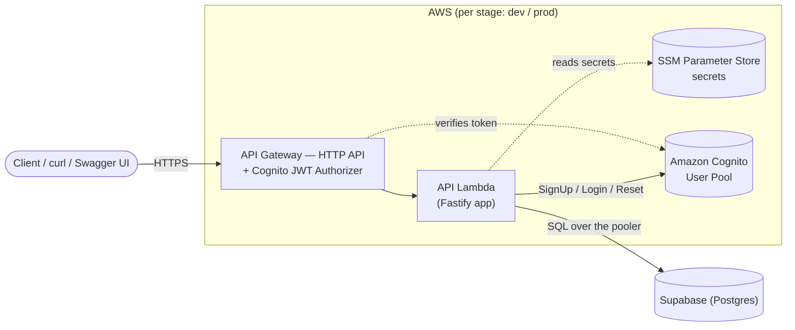

# MedHouse API

A serverless API that lets a household track its members (human or pet) and their
medications, fetches fresh pharmacy pricing (`fetchPrice`) on every create/update, and
ranks the offers (`comparePrices`) synchronously in the same request. Auth is
email/password per household, backed by Amazon Cognito. This is **not** a clinical
advice tool.

- **Runtime**: Node.js 20, TypeScript (strict mode)
- **API framework**: Fastify, running inside AWS Lambda behind API Gateway
- **Data store**: Supabase (Postgres), via the `postgres` driver
- **Architecture style**: hexagonal (ports & adapters) — business logic never
  imports an AWS SDK or a database driver directly

## Table of contents

- [High-level architecture](#high-level-architecture)
- [Tech stack](#tech-stack)
- [Getting started (local, no AWS account needed)](#getting-started-local-no-aws-account-needed)
- [Running locally: mock vs. real AWS](#running-locally-mock-vs-real-aws)
- [Configuring real AWS services](#configuring-real-aws-services)
- [Deploying](#deploying)
- [Commands reference](#commands-reference)
- [API documentation](#api-documentation)
- [Project status](#project-status)

## High-level architecture



One Lambda ("Lambda-lith") handles every HTTP route behind one API Gateway HTTP
API — there's no second/worker Lambda. `fetchPrice` + `comparePrices` run inline,
synchronously, inside the same request that saves the prescription.

Inside the API Lambda, requests flow **routes → use-cases → ports → adapters**:
routes only validate input (Zod) and call a use-case; use-cases contain business
rules and depend only on port *interfaces*; adapters are the only code that talks
to Cognito or Postgres. Swapping `TARGET_SOURCE` (see below) swaps every adapter
for an in-memory/mock one without touching a single use-case.

## Tech stack

| Layer | Choice |
|---|---|
| Language / runtime | TypeScript (strict), Node.js 20 |
| API framework | Fastify + `@fastify/aws-lambda` |
| Validation | Zod (request bodies, query params, env vars) |
| API docs | `@fastify/swagger` + `@fastify/swagger-ui`, generated from the same Zod schemas — never hand-written |
| Database | Supabase (Postgres), `postgres` (postgres.js) driver — relational schema, transactional multi-table writes |
| Auth | Amazon Cognito (User Pool + App Client, one pair per stage) |
| Pricing | `fetchPrice` (this project's own function, hardcoded for now) + `comparePrices`, called inline — no queue |
| Secrets | AWS SSM Parameter Store (`SecureString`), via `@aws-lambda-powertools/parameters` |
| Idempotency | A Postgres `idempotency_records` table, atomic claim via `INSERT ... ON CONFLICT` |
| Observability | `@aws-lambda-powertools/logger` (structured JSON) + `tracer` (X-Ray) |
| Infra as code | Serverless Framework — one config file per stage (`serverless-dev.yml` / `serverless-prod.yml`) |
| Testing | Vitest — unit tests (mocked ports, no I/O) + adapter integration tests against recorded fixtures |
| Compute | AWS Lambda (one API Lambda), Amazon API Gateway (HTTP API) |

## Getting started (local, no AWS account needed)

Prerequisites: Node.js 20+, npm.

```bash
git clone <this-repo>
cd MedAPI
npm install
cp .env.example .env   # defaults to TARGET_SOURCE=mock — nothing else to configure yet
npm run dev             # local Fastify server on http://localhost:3000
```

That's it — with `TARGET_SOURCE=mock` (the default), every outbound call (Cognito,
Supabase, `fetchPrice`) is answered by an in-memory mock adapter reading fixed data
from [`mock-json/mock-data.json`](./mock-json/README.md). No AWS account, no Supabase
project, no API key needed to get a fully working server.

## Running locally: mock vs. real AWS

Every external dependency (Cognito, Supabase, `fetchPrice`) has two
implementations, picked by the `TARGET_SOURCE` env var (`fetchPrice`'s "real"
implementation is itself hardcoded for now — see CLAUDE.md).

### `mock` (default)

```bash
npm run dev
```

A full round trip, start to finish:

```bash
curl -s -X POST localhost:3000/register -H 'Content-Type: application/json' \
  -d '{"email":"demo@yopmail.com","password":"correct-horse-battery-staple"}'

TOKEN=$(curl -s -X POST localhost:3000/login -H 'Content-Type: application/json' \
  -d '{"email":"demo@yopmail.com","password":"correct-horse-battery-staple"}' \
  | python3 -c "import sys,json;print(json.load(sys.stdin)['idToken'])")

curl -s -X POST localhost:3000/prescriptions \
  -H "Authorization: Bearer $TOKEN" -H "Idempotency-Key: demo-1" \
  -H 'Content-Type: application/json' \
  -d '{"members":[{"nickname":"Rex","medicines":[{"name":"Amoxicillin","genericName":"amoxicillin","form":"capsule","strength":500,"strengthUnit":"mg","dosageUnit":"capsule","quantity":2,"frequency":"twice daily","prescriberName":"Dr. Smith","refills":2,"medId":"med-1"}]}]}'
```

Medicine names not listed in `mock-json/mock-data.json`'s
`calls.fetchPrice.response.prices` still work — they fall back to that fixture's
`default` price, quoted across each of its `pharmacies`.

### `aws` — the real thing

```bash
TARGET_SOURCE=aws npm run dev
# or set TARGET_SOURCE=aws in .env to make it the default for your shell
```

Requires a real Cognito user pool/app client and a Supabase project actually
configured in `.env` — see [Configuring real AWS services](#configuring-real-aws-services)
below. Never point this at a project holding real household data from a local machine.

## Configuring real AWS services

Skip this whole section if you only need `mock` mode. To run against real
infrastructure (locally with `TARGET_SOURCE=aws`, or deployed), you need three
things set up once per stage (`dev`/`prod` never share any of them): a Cognito
User Pool + App Client, an SSM parameter, and a Supabase project. All
identifiers/secrets are read from `.env` — see `.env.example` for every variable
and which of these steps populates it.

### 1. Amazon Cognito — User Pool + App Client

```bash
aws cognito-idp create-user-pool --pool-name medhouse-households-<stage> \
  --auto-verified-attributes email \
  --policies '{"PasswordPolicy":{"MinimumLength":10,"RequireUppercase":true,"RequireLowercase":true,"RequireNumbers":true}}'

aws cognito-idp create-user-pool-client --user-pool-id <pool-id> \
  --client-name medhouse-web-client \
  --no-generate-secret \
  --explicit-auth-flows ALLOW_USER_PASSWORD_AUTH ALLOW_REFRESH_TOKEN_AUTH
```

Put the resulting IDs in `.env` as `COGNITO_USER_POOL_ID_<STAGE>` /
`COGNITO_APP_CLIENT_ID_<STAGE>` (and the unsuffixed `COGNITO_USER_POOL_ID` /
`COGNITO_APP_CLIENT_ID` if you're running `TARGET_SOURCE=aws` locally against
`dev`).

### 2. Supabase project

1. Use the shared "HouseMeds" Supabase project (or create your own sandbox one for
   local development — never point a personal sandbox at real household data).
2. Get the pooler connection string (Session or Transaction mode) from the
   project's connection settings.
3. Put it in `.env` as `SUPABASE_DB_URL`.

### 3. SSM Parameter Store — push the secret from `.env`

Once `SUPABASE_DB_URL` is a real value in `.env`, push it to SSM (deployed
Lambdas read secrets from SSM, never from a local `.env` file):

```bash
aws ssm put-parameter --name /medhouse/<stage>/supabase-db-url --type SecureString --overwrite \
  --value "<value from .env's SUPABASE_DB_URL>"
```

## Deploying

```bash
TARGET_SOURCE=mock npm run deploy:dev   # deploy dev, Lambda runs against mock adapters
TARGET_SOURCE=aws npm run deploy:dev    # deploy dev, Lambda runs against real Cognito/Supabase
TARGET_SOURCE=aws npm run deploy:prod   # deploy prod (once prod's Cognito/SSM exist)
```

A stage's target stage (`dev`/`prod`) picks *which* infrastructure gets deployed;
its target source (`mock`/`aws`) picks *what the deployed Lambda talks to* once
live — the two are independent, and either stage can be deployed with either
source. Deploying always redeploys the same physical stack in place (`dev` or
`prod`), overwriting whichever target source it was previously running.

## Commands reference

```bash
npm run dev                # local Fastify server (TARGET_SOURCE=mock by default)
TARGET_SOURCE=aws npm run dev   # ...or against real Cognito/Supabase

npm run typecheck           # tsc --noEmit
npm run lint                # eslint + prettier check
npm run lint:fix            # auto-fix lint/format issues

npm run test                # unit tests — domain/ + usecases/, mocked ports, no I/O
npm run test:watch          # same, watch mode
npm run test:integration    # adapter tests against recorded fixtures

npm run deploy:dev          # sls deploy --config serverless-dev.yml
npm run deploy:prod         # sls deploy --config serverless-prod.yml
```

## API documentation

Every route is documented live by `@fastify/swagger` + `@fastify/swagger-ui`,
generated straight from the same Zod schemas that validate each request — input
and output shapes, auth requirements, and error responses, always current with
the code, never a hand-maintained spec that can drift.

| Environment | Swagger UI | Raw OpenAPI spec |
|---|---|---|
| Local (`npm run dev`) | http://localhost:3000/docs | http://localhost:3000/docs/json |
| `dev` (deployed) | `${API_BASE_URL_DEV}/docs` — see `.env`'s `API_BASE_URL_DEV` | `${API_BASE_URL_DEV}/docs/json` |
| `prod` (deployed) | _not yet deployed_ | _same_ |

`/docs` and `/docs/{proxy+}` are the only routes never behind API Gateway's
Cognito JWT authorizer (alongside `/register`, `/login`, and
`/reset-password*`), so the docs page is reachable by anyone with the URL, no
token needed — `/prescriptions*` and everything else require a valid Cognito
access token. To call a protected route from the Swagger UI page itself: run
`POST /login`, copy the returned `accessToken`, click **Authorize**, paste the
token (no `Bearer ` prefix — Swagger adds that), then any "Try it out" call
sends it automatically.

## Project status

Implemented: all routes, use-cases, domain logic, and adapters (both `mock` and
`aws` target sources) for registration/login/password-reset, prescription
CRUD with soft-delete, and synchronous fetchPrice + comparePrices pricing.
`dev` is deployed and live under both target sources. Not yet done:

- Adapter integration tests against recorded fixtures (`test:integration` has no
  specs yet).
- `prod` — Cognito/SSM/Lambda/API Gateway not yet provisioned.
- A `/confirm-signup` endpoint — Cognito is configured to confirm new accounts via
  an emailed link (handled entirely by Cognito's hosted UI), so no app-side route
  is needed for the current signup flow.
- `fetchPrice`'s real vendor integration — hardcoded canned pricing today, see
  `src/adapters/fetch-price/fetch-price.adapter.ts`; `comparePrices`'
  real ranking logic — currently a cheapest-first placeholder, see
  `src/usecases/compare-prices.ts`.
