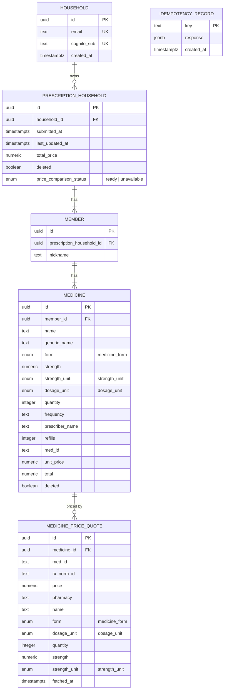

# MedHouse data model

Entities as the domain layer (`src/domain/types.ts`) and the API see them, and how
they map onto the relational schema in Supabase (Postgres). The domain/API shape is
nested (a household embeds its members, who embed their medicines); storage is
normalized — the nesting is reassembled at read time via `json_agg` joins in
`src/adapters/db/prescription.repository.ts`, never stored that way.

## Entity-relationship diagram

`IDEMPOTENCY_RECORD` has no foreign key to anything else — it's keyed purely by the
client's `Idempotency-Key` header (see `src/common/idempotency.ts`), not shown
connected above.

## Enums

| Enum | Values |
|---|---|
| `medicine_form` | `tablet`, `capsule`, `liquid`, `cream`, `ointment`, `gel`, `solution`, `suspension`, `inhaler`, `spray`, `drops`, `patch`, `injection`, `suppository`, `powder`, `lozenge` |
| `strength_unit` | `mcg`, `mg`, `g`, `mL`, `L`, `units`, `IU`, `mEq`, `%` |
| `dosage_unit` | `tablet`, `capsule`, `mL`, `g`, `patch`, `inhaler`, `vial`, `syringe`, `pen`, `ampule`, `suppository`, `lozenge`, `dose` |
| `price_comparison_status` | `ready`, `unavailable` |

`strength` + `strengthUnit` describe the medicine itself (e.g. 500mg = `strength:
500, strengthUnit: 'mg'`). `quantity` + `dosageUnit` describe what was
dispensed/ordered (e.g. 500 capsules = `quantity: 500, dosageUnit: 'capsule'`).

## Domain objects (TypeScript, `src/domain/types.ts`)

- **`Household`** — `id`, `email`, `cognitoSub` (Cognito is the sole credential
  store — no password/hash here), `createdAt`.
- **`PrescriptionHousehold`** — one household's submitted prescription: `id`,
  `householdId`, `submittedAt`, `lastUpdatedAt`, `totalPrice` (server-computed,
  sum of non-deleted medicines' `total`), `deleted` (soft-delete only),
  `members: Member[]`, `priceComparisonStatus`, `priceComparisons: FetchPriceQuote[]`.
- **`Member`** — `id`, `nickname`, `medicines: Medicine[]`.
- **`Medicine`** — `id`, `name`, `genericName`, `form`, `strength`,
  `strengthUnit`, `dosageUnit`, `quantity`, `frequency`, `prescriberName`,
  `refills`, `medId`, `unitPrice` (verbatim from a fetchPrice quote — never
  computed), `total` (`quantity * unitPrice`, recalculated server-side), `deleted`.
- **`FetchPriceRequestItem`** — what `fetchPrice` is asked for one medicine line:
  `medicineId`, `name`, `form`, `dosageUnit`, `quantity`, `strength`, `strengthUnit`.
- **`FetchPriceQuote`** — one pharmacy's offer: extends `FetchPriceRequestItem`
  plus `rxNormId`, `medId`, `price`, `pharmacy`. `comparePrices`
  (`src/usecases/compare-prices.ts`) ranks these; the ranked list is what gets
  stored as `PrescriptionHousehold.priceComparisons` and returned to the client.
- **`PrescriptionSummary`** — the list-view projection: `id`, `submittedAt`,
  `lastUpdatedAt`, `totalPrice` (no member/medicine detail — see `GET /prescriptions`).

## Notes

- Soft delete only: `PrescriptionHousehold.deleted` and `Medicine.deleted` are
  booleans flipped in place — nothing is ever physically removed (hard rule 1 in
  `CLAUDE.md`). Postgres rows for members/medicines are likewise never deleted,
  only upserted — see `upsertMembersAndMedicines` in `prescription.repository.ts`.
- `medicine_price_quotes` is fully replaced (delete + reinsert) on every
  add/update, mirroring the old embedded-array's overwrite semantics — it is not
  an append-only price-history table.
- `Medicine.medId` (set by whoever submits the medicine) and
  `FetchPriceQuote.medId` (returned per pharmacy offer by `fetchPrice`) are
  independent fields that happen to share a name — `fetchPrice` doesn't take
  `Medicine.medId` as an input (see its port, `src/ports/fetch-price.port.ts`).
