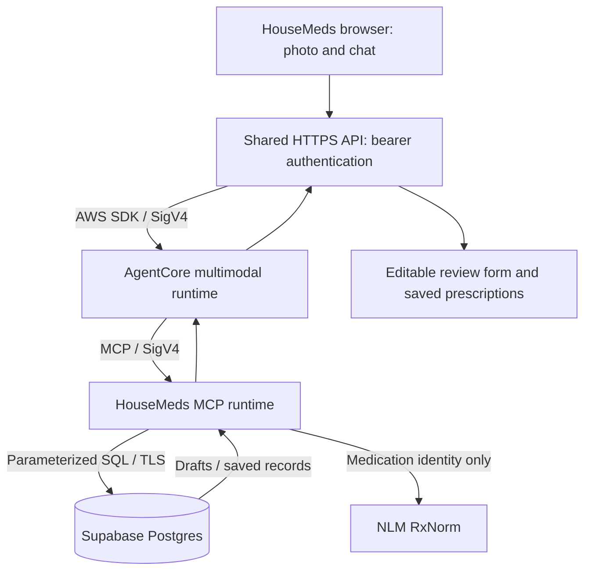

# HouseMeds prescription agent

**Shared teammate setup:** use the [independent HTTPS API](../backend/PRESCRIPTION_API.md). The frontend runs separately and only needs the API URL and bearer token. The local cookie-based adapter below is retained for diagnostics; it is not required by the shared API.

The independent mobile UI in `frontend/` calls the shared HTTPS API, which invokes AWS AgentCore. Its multimodal runtime reads prescription labels or medication lists with Amazon Nova 2 Lite through its US inference profile and calls a separate, IAM-protected HouseMeds MCP runtime. Only that MCP runtime has the Supabase database credential.



## Flow

1. Upload JPEG, PNG, WebP, or HEIC. HEIC decoding runs in the browser using the installed `heic-to` CSP build. Photos over the model's size/dimension limits are prepared locally before transmission. The original file is unchanged.
2. The agent calls `list_members`, transcribes the image, calls `normalize_medication`, and atomically stores all detected medicines with `save_drafts`.
3. The form asks “Who is this for?” and lets the user choose a medicine and edit its fields. Chatting a member's exact nickname selects them for review.
4. **Review prescription** opens the existing mobile medicine form with extracted fields. The explicit Save action calls `get_draft` and `create_prescription`, then reloads saved prescriptions through MCP. Choosing a member alone does not save.
5. Drafts survive runtime expiry and browser reload. The database prevents duplicate prescriptions for the same draft and serializes concurrent saves. Retrying an upload with the same request ID reuses the original batch even if a later model extraction differs.

Manual entry uses a `prepare` action to validate fields and save a draft without model extraction. Unknown or unclear values remain empty or carry warnings. Original brand/label text is preserved alongside a separately labeled RxNorm identity. Name-and-strength input such as `Zoloft 100mg` can resolve to an exact ingredient-strength concept (`sertraline 100 MG`) without assuming a dosage form. Unknown or ambiguous RxNorm matches are not silently replaced. This records user-reviewed information; it does not prescribe or recommend substitutions. Multi-medicine photographs remain a review queue; users save each medicine individually.

## Legacy pricing and diagnostic web server

```sh
cd /Users/sonthach/housemed/backend
npm ci
npm run web
```

The web server reads the ignored `.env.agentcore`. Its required keys are:

```dotenv
AWS_PROFILE=sovyr-admin
AWS_REGION=us-east-1
HOUSEMED_AGENT_RUNTIME_ARN=arn:aws:bedrock-agentcore:REGION:ACCOUNT:runtime/AGENT
HOUSEMED_HOUSEHOLD_ID=AUTHORIZED_HOUSEHOLD_UUID
HOUSEMED_HOUSEHOLD_NAME="HouseMeds test household"
WEB_HOST=127.0.0.1
WEB_PORT=63814
```

The PR #4 mobile app runs independently with `npm run dev` in `frontend/`; `/app/` redirects to that frontend. `/prescriptions` remains a diagnostic review page. The existing pricing app remains at `/`. The separate `MedAPI/` Mongo/Cognito implementation is unchanged; the new prescription route uses Supabase through MCP.

## AWS deployment

From the repository root:

```sh
uv venv --python 3.13 agentcore/.venv
uv pip install --python agentcore/.venv/bin/python -r agentcore/requirements.txt -r agentcore/requirements-dev.txt
agentcore/.venv/bin/python agentcore/deploy.py --profile sovyr-admin
```

`deploy.py` packages only an explicit list of runtime source files, a CA certificate, and Linux ARM64 dependencies. It creates or updates two AgentCore runtimes, two scoped IAM roles, and a private encrypted S3 code bucket. It records nonsecret deployment identifiers in `agentcore/.cache/deployment.json`. Both runtimes use IAM authorization, a five-minute idle timeout, and a thirty-minute maximum lifetime. AWS usage is billable; the resources remain deployed for subsequent use.

The agent role can invoke the configured model's inference profile, its listed regional foundation models, and the HouseMeds MCP runtime. The MCP role can read only the named database secret. Runtime logs contain operational metadata, not images or prescription contents. The code does not store uploaded image bytes in S3 or Postgres; extracted review drafts and saved fields are persisted in Supabase. Use `--model-id` to change the deployed model and corresponding scoped IAM permissions.

## Database setup

Apply these versioned migrations to the existing HouseMeds Supabase project using its administrator SQL editor:

- `backend/supabase/migrations/20260912210000_prescription_intake.sql`
- `backend/supabase/migrations/20260912214500_prescription_photo_batches.sql`

For a new installation, `setup_database.py prepare` creates an ignored, mode-600 SQL setup file using the host/project from `backend/.env`'s `READ_DATABASE_URL`. The generated SQL includes both migrations, a **new** restricted service login's SCRAM verifier, and a clearly named test household with Grandma and Self. Apply this setup once; do not reapply it to an already migrated database. No existing administrator or reader password is changed.

After applying the prepared SQL, `setup_database.py finish` verifies the service login, stores it as `housemed/mcp-database` in AWS Secrets Manager, and writes `.env.agentcore`. Only the MCP role reads this secret. The `housemed_mcp` database role cannot create schemas/households/members or access the existing private pricing data. The intake schema is not exposed through the Supabase public Data API. Parameterized tenant conditions and RLS both scope requests to a household.

## Trust boundary and deployment scope

The legacy diagnostic web adapter is a **local, single-household application**. It binds to loopback, checks Host and Origin, and uses an HttpOnly SameSite session cookie. Browsers cannot submit a household ID or receive AWS/database credentials. Runtime payloads come from trusted IAM-authorized backend callers; household authorization is that caller's responsibility. Do not give end-user IAM identities direct access to the agent runtime.

The shared HTTPS API accepts every frontend origin and binds its bearer token to a configured household. Supporting multiple independently authorized households requires a per-user authenticated household resolver. This implementation does not claim public multi-tenant authentication, clinical validation, or a healthcare compliance certification.

## Verification

```sh
cd backend
npm run check
npm run build
npm run pretest
cd ..
PYTHONPATH=agentcore agentcore/.venv/bin/python -m pytest agentcore/tests -q
agentcore/.venv/bin/python agentcore/invoke.py --state
```

The legacy pricing assistant regression suite additionally requires its pinned Codex CLI `0.153.1`. Set both `HOUSEMED_CODEX_BIN` and `HOUSEMED_TEST_CODEX_BIN` to that binary when running `npm test`; do not relax the version restriction just to make the test pass.

For an API-only synthetic intake:

```sh
agentcore/.venv/bin/python agentcore/invoke.py --message "Add Zoloft 100mg tablets; quantity 30."
```

For Chrome acceptance, upload a photo, verify the draft and member choice, review against the source, save one medicine, then reload and verify the same saved record. Raw responses and screenshots that contain medical information belong in ignored local `.cache/` evidence, never committed fixtures. The included `tests/fixtures/prescription-demo.png` is explicitly synthetic.

## References

- [AWS AgentCore direct Python deployment](https://docs.aws.amazon.com/bedrock-agentcore/latest/devguide/runtime-get-started-code-deploy-python.html)
- [AWS AgentCore MCP runtime contract](https://docs.aws.amazon.com/bedrock-agentcore/latest/devguide/runtime-mcp.html)
- [InvokeAgentRuntime API](https://docs.aws.amazon.com/bedrock-agentcore/latest/APIReference/API_InvokeAgentRuntime.html)
- [NLM RxNorm API](https://lhncbc.nlm.nih.gov/RxNav/APIs/RxNormAPIs.html)
- [heic-to browser conversion and CSP build](https://github.com/hoppergee/heic-to)
